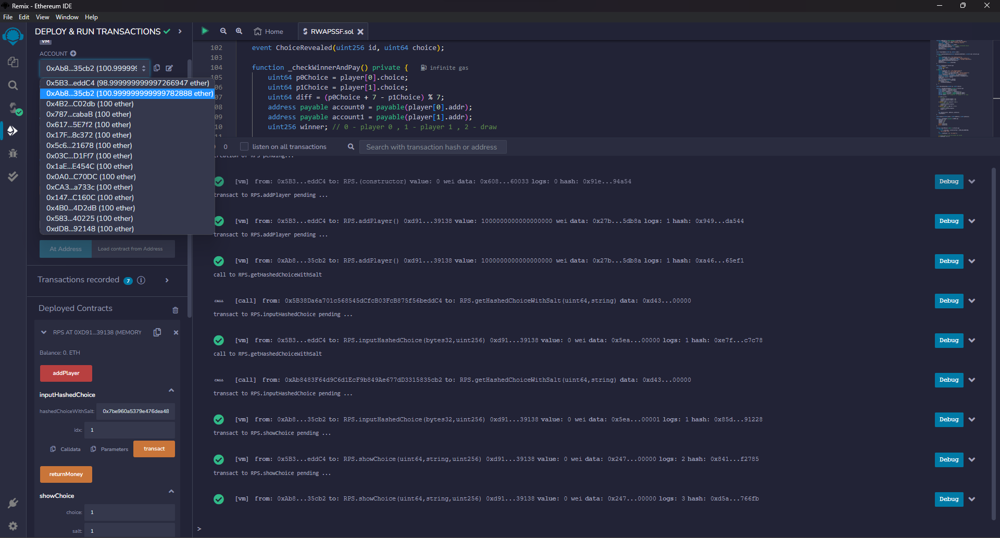
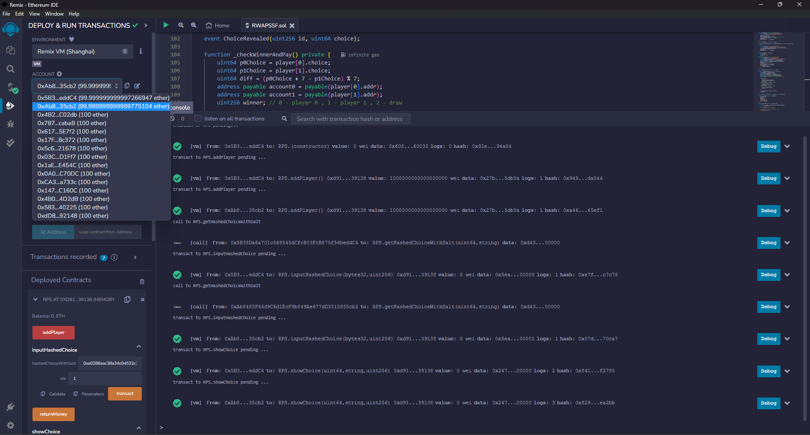

# RWAPSSF Smart Contract

This repository contains a Solidity smart contract for a betting game based on Rock, Water, Air, Paper, Sponge, Scissors, and Fire (RWAPSSF).

## Description

The smart contract allows users to bet on the outcome of a game of RWAPSSF. The game rules are as follows:

- ROCK POUNDS OUT FIRE, CRUSHES SCISSORS & SPONGE.
- FIRE MELTS SCISSORS, BURNS PAPER & SPONGE.
- SCISSORS SWISH THROUGH AIR, CUT PAPER & SPONGE.
- SPONGE SOAKS PAPER, USES AIR POCKETS, ABSORBS WATER.
- PAPER FANS AIR, COVERS ROCK, FLOATS ON WATER.
- AIR BLOWS OUT FIRE, ERODES ROCK, EVAPORATES WATER.
- WATER ERODES ROCK, PUTS OUT FIRE, RUSTS SCISSORS.

## Installation

The smart contract can be compiled, deployed, and tested using the Remix IDE at [https://remix.ethereum.org/](https://remix.ethereum.org/).

## Usage

The smart contract can be used to play a game of RWAPSSF as follows:

### step 1: enter the game

- call the `addPlayer` function to enter the game
- send 1 ETH to the contract as the bet amount
- the contract will emit a `PlayerAdded` event to indicate that a player has entered the game and the player's ID

### step 2: generate a hashed choice

- call the `getHashedChoiceWithSalt` function to generate a hashed choice
- the function takes the player's choice and a random salt string as input
- this function must be called off-chain to secure the player's choice
- keep the choice and salt secret until the reveal step

### step 3: commit the hashed choice

- after both players have entered the game, call the `inputHashedChoice` function to commit the hashed choice
- the function takes the hashed choice and the player's ID as input
- the contract will emit a `CommitHash` event to indicate that the player has committed the hashed choice

### step 4: reveal the choice

- after both players have committed their hashed choices, call the `showChoice` function to reveal the choice
- the function takes the player's choice, the random salt string, and the player's ID as input
- the contract will emit a `ChoiceRevealed` event to indicate that the player has revealed the choice

### step 5: check the winner

- after both players have revealed their choices, the contract will check the winner and distribute the ETH bets accordingly
- the contract will emit a `Winner` event to indicate the winner and the choices of both players
- the contract will reset the game after determining the winner

### extra: withdraw the bet

- you can withdraw the bet manually by calling the `returnMoney` function under the following conditions:
  - no one join the game within **TIME_IDLE_DURATION**
  - no one commit their choice within **TIME_IDLE_DURATION**
  - no one reveal their choice within **TIME_IDLE_DURATION**
  - one player commit their choice and the other player not commit their choice within **TIME_IDLE_DURATION**
  - one player reveal their choice and the other player not reveal their choice within **TIME_IDLE_DURATION**

## Security

- prevent front-running by using a commit-reveal
  - players commit their choice by hashing it with a random salt string
  - after both players have committed, they reveal their choice and salt
  - the contract checks that the revealed hash matches the committed hash
  - the contract then determines the winner and distributes the ETH bets accordingly
- prevent locked ETH by using time limits
  - if other player not join the game within **TIME_IDLE_DURATION**, the first player can withdraw his bet
  - if no one commit their choice within **TIME_IDLE_DURATION**, both players can withdraw their bet
  - if no one reveal their choice within **TIME_IDLE_DURATION**, both players can withdraw their bet
  - if one player commit their choice and the other player not commit their choice within **TIME_IDLE_DURATION**, the first player can withdraw all the bets
  - if one player reveal their choice and the other player not reveal their choice within **TIME_IDLE_DURATION**, the first player can withdraw all the bets

## Example Game

- player 1 wins player 0 loses
  

- draw
  
